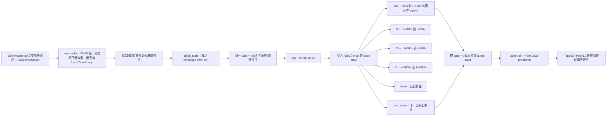

# `opening_strength_fit` 未来信息泄露专项审计

审计日期：2026-08-12
审计对象：当前权威 DS350 特征、五个 horizon label、36 个月 rolling/OOS 神经网络及 Pool-L 选股分析。
因果判据：每个样本的任一输入原始信息，其真实可获得时间必须满足 `information_timestamp <= decision_time`。

## 结论

**状态 2：未发现明确泄露，但仍存在未排除风险。**

已确认的是标记决策时点与本地接收时点不一致；在核实真实推理截止时点之前，不能把它直接定性为策略未来信息泄露：

- 原始缓存按 `ExchTimeOffsetUs` 和最新 `LocalTimeStamp` 去重，但输出 Parquet 丢弃了 `LocalTimeStamp`；后续在每个逻辑时点 `t` 选择 `exchange_timestamp <= t` 的最后状态，没有验证该状态在 `t` 时是否已经到达。
- 对 2025 年每月首个交易日、09:31–09:40 十个时点做了底层 ClickHouse 重放，共 615,810 个选中状态。其中 421,701 个（**68.4791%**）的本地接收时间晚于逻辑决策时间；延迟 p50 为 **0.4625s**、p95 为 **1.6620s**、p99 为 **1.7699s**、最大为 **1.8567s**。
- 同样的底层选择改成 `exchange_timestamp <= t-2s` 后，615,810 个状态中决策后到达数为 **0**，最晚接收时间仍比 `t` 早 **0.9637s**。这支持用 `-2s` 做 2025 年的初始隔离线，但不能证明 2022–2024 安全：这三年的 `LocalTimeStamp` 在季度抽样的 590,920 个状态上覆盖率为 **0%**。
- 当前买入点是 `t+6s`。2025 抽样里的晚到状态全部在 `t+2s` 内，没有跨过 `t+6s` 买入点。如果生产流程允许在 `t` 后收齐数据并在 `t+6s` 前完成推理下单，则这些状态仍可能是因果可交易的；只有真实推理/选股截止时点就是 `t`，才构成题设定义下的未来信息泄露。当前仓库没有把这个生产时序合同写清楚。

目前既不能确认该时钟边界构成生产泄露，也不能量化它对 IC、Top100 超额或涨停富集的影响。完整重训尚未运行。`-2s` 冒烟重建只证明 cutoff 会显著改变特征，不证明原特征不可交易：2025-01-02 的 51,050 行保持完全相同的键，但 51,031 行（99.963%）至少一个特征改变，350 个特征中 301 个改变，约 49.252% 的特征单元发生变化。

## 审计范围和产物血缘

当前权威训练配置为 `experiments/runs/nn_ds350_label15_36m_grouped_gated_v2_mse_max30_v1.toml`：350 个特征、36 个月训练、6 个月测试、2022-01 至 2025-12、`grouped_gated_v2`、30 epochs。模型配置未启用 universe 或 stock-pool 过滤；Pool-L 是分析阶段的同日选股口径。

特征配置为 `experiments/runs/opening_0931_0940_features_350.toml`：原始缓存从 09:15 起，09:30–09:40 为上下文时点，09:31–09:40 为输出时点，历史上下文 120 个交易日。

PVC 实物检查结果：

| 年份 | feature 行数 | 1m label 行数 | 三个键逐行完全相同 |
| ---: | ---: | ---: | :---: |
| 2019 | 8,883,400 | 8,883,400 | 是 |
| 2020 | 9,488,030 | 9,488,030 | 是 |
| 2021 | 10,600,410 | 10,600,410 | 是 |
| 2022 | 11,467,600 | 11,467,600 | 是 |
| 2023 | 12,096,570 | 12,096,570 | 是 |
| 2024 | 12,333,410 | 12,333,410 | 是 |
| 2025 | 12,482,460 | 12,482,460 | 是 |

2025 年的 1m、3m、10m、1h、close 五份 label 都分别有 12,482,460 行，均与 feature 的 `(date, symbol, decision_target_timestamp)` 逐行完全一致。Feature Parquet 只含三个键和 350 个特征；label 存放在独立 Parquet 中。

血缘仍有审计缺口：2025 raw manifest 记录 `source_revision=3d6cec23b138+worktree-42ec6bdd`，而指标产物记录的代码 revision 是 `33951ac...`；feature manifest 没有代码 revision，也没有逐样本 `max_source_timestamp`。这不单独证明泄露，但妨碍精确复现当前线上结果。

## 完整数据时序



### 分钟时间戳的实际含义

`09:35` 不是 `[09:35:00, 09:35:59]` 的分钟聚合。当前特征路径不做 `floor`、`ceil` 或 minute resample；它用 `merge_asof(direction="backward")` 选择交易所时间不晚于 **09:35:00.000000** 的最后一条状态。因此按交易所时间看，特征右边界是 `t`；按实际接收时间看，当前实现没有边界，这正是本次确认的问题。

### Feature/label 边界

| label | decision | feature 的交易所时间上界 | buy | label 起点 | label 终点 | 交易所时间 overlap |
| --- | --- | --- | --- | --- | --- | :---: |
| 1m | `t` | `<=t` | `t+6s` | `t+66s` | `t+126s` | 否 |
| 3m | `t` | `<=t` | `t+6s` | `t+186s` | `t+246s` | 否 |
| 10m | `t` | `<=t` | `t+6s` | `t+606s` | `t+666s` | 否 |
| 1h | `t` | `<=t` | `t+6s` | `t+3606s` | `t+3666s` | 否 |
| close | `t` | `<=t` | `t+6s` | 当日收盘 | 当日收盘 | 否 |
| next close | `t` | `<=t` | `t+6s` | T+1 收盘 | T+1 收盘 | 否 |

短周期 label 使用未来累计 `Volume/Turnover` 在两个 clock state 的差构造 VWAP。`searchsorted(..., side="right")-1` 保证各状态的交易所时间不晚于各自目标点。未来值只在 label 侧；feature 与 label 分文件，训练读取时显式拒绝 feature 中出现 label 列。

因此 `IC 0.144 -> 0.022` 的 horizon 衰减不能由交易所时间窗口直接重叠解释，但与已确认的约 0–1.86 秒信息可用性泄露相容；必须用完整 hard-cutoff 重训判断影响大小。

## 底层可获得时间实测

审计脚本 `src/opening_strength_fit/commands/tick_availability_audit.py` 复现了 raw-cache 的去重顺序，再对每个 symbol/clock 选最后交易所状态，并把 `LocalTimeStamp` 统一识别为微秒或纳秒 epoch。

| 数据 | cutoff | 状态数 | 接收时间覆盖 | `receipt>t` | p50 | p95 | p99 | max |
| --- | ---: | ---: | ---: | ---: | ---: | ---: | ---: | ---: |
| 2025 每月首日 × 10 clocks | 0s | 615,810 | 100% | 68.4791% | +0.4625s | +1.6620s | +1.7699s | +1.8567s |
| 同一批样本 | -2s | 615,810 | 100% | 0% | -2.2858s | -1.2781s | -1.0618s | -0.9637s |
| 2022–2024 每季度首日 × 10 clocks | 0s | 590,920 | 0% | 不可判定 | — | — | — | — |

2025 样本中接收时间字段有 153,440 行为微秒、462,370 行为纳秒。抽查的 2025-01、04、12 三天未发现相同 `(TradingDay, Symbol, ExchTimeOffsetUs)` 的重复键，且单行 map 内未发现混合单位，所以本次没有确认“单位切换导致错误去重”；但 schema 单位不统一应在生产侧规范化。

审计 JSON：

- `output/diagnostics/leakage_audit/tick_availability_2025_monthly.json`
- `output/diagnostics/leakage_audit/tick_availability_2025_monthly_cutoff2.json`
- `output/diagnostics/leakage_audit/tick_availability_2022_2024_quarterly.json`

## 分模块代码审计

### Daily/EOD

当前 350 个特征名中没有当日最终 `Close/High/Low/Volume/Turnover/UpdownLimitStatus` 或 label 列。日频特征只投影 `TotalMarketValue/TotalFloatMarketValue/TotalShareToday/FloatAShare/FreeShareToday`，并用 `date < trading_day` 的最后一天，即 T-1；代码同时记录 `market_cap_reference_lag_sessions=1`。

Tick 中的 `Volume/Turnover/High/Low` 是该 tick 当时的累计快照，不是通过当日最终行回填。最终 350 列也没有直接保留 raw High/Low。预开盘数据显式截到 09:25:30。

### 截面处理

当前显式截面分母 `postopen_turnover_diff_1m_to_xs_median` 的 grouping key 是 `(date, decision_target_timestamp)`。通用 cross-sectional transform 默认和配置也都使用这两个键，不会把一天内 09:31–09:40 混在一起。

当前 `mechanismized_v3_dimensionless_328` 主要做机制化/无量纲变换，配置的 broad cross-sectional mode 为 `none`；最终 350 中没有一整套额外 `xs_rel_*`。Feature-family kill test 因此把第 5 步准确命名为 `plus_mechanism_v3`，而不是假称当前模型存在 broad `xs_relative`。

### Rolling/history/path

`hist_surprise` 先按 `(symbol, clock)` 排序，再 `shift(1)` 后 rolling；T 日值不进入自己的历史均值/标准差。日活跃度先按 symbol/date 形成日内值，再 `shift(1)` 后 rolling。`path_shape` 的 `cummax/cummin/rolling` 只在当前日已排序的历史路径上包含当前及过去时点。

Feature 代码中未发现 `center=True`、`bfill/backfill`、`merge_asof(direction="nearest")` 或 feature 侧 `shift(-1)`。负向 shift 和 forward-asof 只出现在 label/legacy label 构造路径，不在当前 350-feature 执行路径。

### Join/alignment

特征采样的 `merge_asof` 是 `direction="backward"`。新增的 hard-cutoff 模式在读取 Parquet 时对每个决策时点分别施加 `ExchTimeOffsetUs <= t-cutoff` 的物理过滤，并断言实际匹配的 source time 不晚于 cutoff。

原来的 `trusted_model_ready_split` 只抽样检查键，理论上可能静默接受中间错行。本次已改为分块检查所有三键。现有 PVC 五类 label 的实际全量检查也全部通过。

### Pool/universe

Pool-L 文件为 `lml.bzw@ssd/data/pool_L.parquet`，审计时对象大小 3,603,777 bytes，最后修改时间 2026-05-26 07:19:03 UTC；覆盖 2020-01-02 至 2025-12-31，1455 日 × 5420 symbols，每日成员中位数 3328、最大 3500。

仓库中没有 Pool-L 的生成代码、生成时点、上游字段或不可变版本。当前分析使用 `date_lag_sessions=0`，代码会直接拿 T 日 membership。因此“同日 Pool-L 在 T 日 09:31 是否已知”无法证明。它不进入当前模型 X 或训练 universe，但会影响用户看到的 Pool-L Top100 策略指标。必须提供 point-in-time pool manifest，或至少补做 `pool lag=1` 与全 A 股口径。

### 训练、validation 与 OOS

rolling 代码把训练月结束设为测试月前一月，未发现 train/test 日期混用。Torch 的 scaler 在训练 frame 上拟合，测试只使用保存的 mean/scale；没有 fit train+test。

有一个较低级别的 validation 纯度问题：标准化统计在随机抽取 1% validation 之前用全部训练 frame 拟合，因此 validation 行参与了 scaler 的 mean/scale 和 early-stopping 选择。这不会把 OOS 测试信息送入模型，但会令 validation 略偏乐观。更严格的实现应先切 validation，再只用 inner-train 拟合 scaler。

当前 2022–2025 的所有 OOS 结果反复用于架构/label/epoch 选择，没有未触碰的最终 holdout。这是研究选择偏差，不是逐样本未来信息泄露，但意味着现有 OOS 不应被视为一次性确认集。

## 风险清单

| 文件 / 函数 / 行 | 风险 | 原因 | 是否确认 | 状态与修复建议 |
| --- | :---: | --- | --- | --- |
| `commands/raw_source_cache.py:165-203` `tick_source_sql`; `sampling.py:64-171` | 高 | raw 去重使用 `LocalTimeStamp`，输出却不保留它；feature 只约束交易所时间 `<=t` | **确认时钟边界不一致；泄露未确认** | 2025 有 68.4791% 状态在 `t` 后接收但全在 `t+2s` 内。先核实真实推理截止时点及机器时钟同步；若截止就是 `t`，再按 receipt time 修复 |
| ClickHouse `LocalTimeStamp`; `tick_availability_audit.py:24-174` | 高 | 2022–2024 接收时间为 0/缺失，无法验证历史真实可用时间 | 未确认、未排除 | 回填可靠 ingestion timestamp；无法回填时用可证明的保守 latency cutoff 并做敏感性曲线，不得把 2025 的 -2s 结论外推 |
| `stock_pool.py:248-265` `_pool_row_codes` | 高 | `date_lag_sessions=0` 直接使用 T 日 Pool-L，而仓库无其生成时点和上游血缘 | 未确认、未排除 | 冻结带 `information_available_at` 的 pool 版本；主结果同时报告 all-stock、pool lag=1、point-in-time pool |
| `training_modeling.py:76-175` `filter_configured_training_rows` | 高（潜伏） | 若启用，会用 T 日最终 `UpdownLimitStatus` 过滤训练样本，是未来结果条件化 | 当前配置未启用 | 禁止用于信号训练，或只用 T-1 可得状态；增加配置 guardrail，检测同日 EOD 字段即拒绝 |
| raw/feature manifests | 中 | raw 是 dirty-worktree revision，feature manifest 无代码 revision/receipt 上界 | 未确认泄露 | 所有数据集记录 git SHA、dirty diff hash、输入 object version、`max_source_timestamp` 与 receipt-time coverage |
| `training_data.py:694-730` `_validate_model_ready_split_keys` | 中（已修） | 原 trusted path 的抽样键检查可能漏掉中间错行 | 未发现现有错行 | 已改为全量分块逐行三键验证；PVC 2019–2025 实测完全一致 |
| `torch_model/training.py:304-369` | 低 | scaler 在 validation 切分前拟合，validation 参与 mean/scale | 是，限 validation | 先切 inner-train/validation，再 fit scaler；不影响 OOS test 的因果时间边界 |
| 当前 OOS 研究流程；权威 config `:1-5,24-54` | 中 | 多轮使用同一 2022–2025 OOS 做模型选择 | 是，研究偏差 | 锁定方案后使用未触碰的新时期或 walk-forward shadow period；与 look-ahead 分开报告 |
| `training_dataset_features.py:58-106` | 低（已加固） | 旧实现会把包含 EOD 列的 daily frame 读入进程，虽只派生 T-1 列 | 未发现当前泄露 | 已只投影允许的 T-1 列，避免同日 EOD 字段进入 feature 进程 |

## 已确认安全的部分

- **交易所时间边界**：`clock_state` 是 backward-asof，标为 09:35 的行最多使用到 09:35:00 的交易所状态；没有分钟右闭区间误读。
- **label 起点**：买入为 `t+6s`；1m/3m/10m/1h 的卖出 VWAP 都严格在各自未来窗口，和 feature 的交易所时间无 overlap。
- **Daily 分母**：市值和股本来自 T-1；没有 `opening_volume/full_day_volume`、`current_price/daily_high` 等当日最终分母。
- **截面键**：已检查的 rank/median/normalization 均包含完整 decision timestamp。
- **历史特征**：`hist_surprise` 和 daily activity 都在 rolling 前 `shift(1)`；path feature 只含当前及过去路径。
- **危险操作搜索**：当前 feature 路径没有 `bfill/backfill`、负 shift、nearest/forward asof 或 centered rolling。
- **X/y 隔离**：feature 与 label 分文件；350 列中没有 label/EOD 最终状态；实际全量三键一致。
- **rolling OOS**：训练月严格早于测试月；测试 scaler 使用 train-only 统计。

这些安全结论只覆盖列出的维度，不能排除 receipt-time 风险，也不能替代生产推理时序合同或 Pool-L 的 point-in-time 血缘。

## 涨停富集专项判断

现有结果显示最终涨停贡献随 horizon 增大、1m Top100 剔除最终涨停后收盘超额转负，这足以把最终涨停富集列为重点异常，但不够把它归因于某个单一 feature。

当前仓库已有 gate diagnostics 和极端 path 选择诊断；例如部分折中 `book_shape`、`trade_activity`、`historical_surprise` gate 较高。但 gate mean 不是 permutation importance 或 SHAP，不能当作“泄露变量定位结果”。本轮没有可诚实报告的全量单特征 permutation/SHAP 结果。

优先排查顺序应是：

1. 先完成 receipt-time hard-cutoff 重训，观察 1m IC 与最终涨停率是否同时崩塌。
2. 在不使用 Pool-L 的 all-stock raw-safe baseline 上测最终涨停率，隔离 pool 富集。
3. 逐组加回 feature；若某一步 IC 小变但最终涨停率跳升，再只对该组做单变量 AUC、distribution、permutation importance。

已准备的汇总脚本会统一输出 own-label IC/Top100 excess、same-day-close excess、next-close excess 和 Top100 最终涨停率，避免只看 IC。

## Kill tests

### A. 数据库/原始层 hard cutoff

#### 已实际完成

1. ClickHouse 可获得时间预检：结果见上文 615,810 状态的 `0s` 与 `-2s` 对照。
2. PVC 单日端到端 feature 冒烟：Kubernetes Job `os-leak-cutoff-smoke-v1` 两个 indexed pod 均成功，分别从原始 Parquet 物理截断后重建：
   - cutoff 0s：51,050 行、350 features；
   - cutoff 2s：51,050 行、350 features。
3. Job `os-leak-smoke-compare-v1` 核验两个产物：三键完全相同；99.963% 行、301/350 特征有变化，49.252% 特征单元改变。结果写入 PVC `leakage_audit/smoke_cutoff_0s_vs_2s.json`。
4. 两阶段 map/reduce 等价性验证：十个单-clock map shard 合并后的 51,050 行、350 特征与原年度式 `-2s` smoke 在 canonical sort 后三键完全一致、所有值 bitwise 完全一致，有限值最大绝对差为 0。结果写入 PVC `leakage_audit/smoke_mapreduce_equivalence_v2.json`。

#### 完整 OOS 结果状态

尚未运行 35 个年度 feature 分片和 25 个 GPU 训练分片，因此下表除当前输入观察值外必须保留为空：

| cutoff | 1m IC | 1m Top100 excess | close excess | next-close excess | Top100 最终涨停率 |
| --- | ---: | ---: | ---: | ---: | ---: |
| 当前已发布观察值（旧 X） | 0.14374 | 11.76 bps | 17.83 bps | 17.42 bps | 约 4%+ |
| 0s 从头重建 | 未运行 | 未运行 | 未运行 | 未运行 | 未运行 |
| -2s | 未运行 | 未运行 | 未运行 | 未运行 | 未运行 |
| -10s | 未运行 | 未运行 | 未运行 | 未运行 | 未运行 |
| -30s | 未运行 | 未运行 | 未运行 | 未运行 | 未运行 |
| -60s | 未运行 | 未运行 | 未运行 | 未运行 | 未运行 |

完整重建采用两阶段 map/reduce：先按 `cutoff × year × decision_clock` 生成 350 个物理隔离的 base shard，再按 `cutoff × year` 合并十个 clock 并统一计算跨日 history、daily activity、截面和最终 350 列。这样既保证每个 map 进程不读入其决策时点之后的 tick，也避免年度单进程串行重复十个 clock。

可直接运行：

```bash
experiments/scripts/apply_leakage_audit_code_configmap.sh
hfcli kubectl apply -f experiments/jobs/support/leakage_audit_2026_08/leakage_hard_cutoff_clock_base_v2_job.yaml
hfcli kubectl wait --for=condition=complete job/os-leak-cutoff-clock-base-v2 --timeout=7d
hfcli kubectl apply -f experiments/jobs/support/leakage_audit_2026_08/leakage_hard_cutoff_clock_reduce_v2_job.yaml
hfcli kubectl wait --for=condition=complete job/os-leak-cutoff-clock-reduce-v2 --timeout=7d
hfcli kubectl apply -f experiments/jobs/support/leakage_audit_2026_08/leakage_hard_cutoff_1m_nn_train_v1_job.yaml
hfcli kubectl wait --for=condition=complete job/os-leak-cutoff-1m-nn-v1 --timeout=14d
```

### B. 绝对安全 raw-feature baseline

已准备 `--raw-feature-values` 和 `--physical-tick-cutoff-seconds 2`。重建时按每个 decision 单独在 Parquet 层过滤；训练用简单 LightGBM，不使用 Pool-L。允许列表以当前可见 orderbook 为起点，再逐步添加当时累计 trade/auction/momentum。

需要强调：名字为 raw-safe 不等于它已经通过全历史 ingestion-time 证明；2022–2024 的接收时间缺失仍是限制。其意义是同时移除复杂机制化、历史、路径和外部 pool，减少潜在泄露面。

```bash
experiments/scripts/apply_leakage_audit_code_configmap.sh
hfcli kubectl apply -f experiments/jobs/support/leakage_audit_2026_08/leakage_raw_features_cutoff2_v1_job.yaml
hfcli kubectl wait --for=condition=complete job/os-leak-raw-features-c2-v1 --timeout=7d
```

### C. Feature-family 逐组加回

已准备 8 个 indexed LightGBM 累积组：

| index | feature set | 输入根 |
| ---: | --- | --- |
| 0 | raw orderbook | raw-value, -2s |
| 1 | + trade | raw-value, -2s |
| 2 | + auction | raw-value, -2s |
| 3 | + momentum/postopen | raw-value, -2s |
| 4 | + mechanismized v3（当前没有 broad xs-relative） | model-ready, -2s |
| 5 | + hist_surprise | model-ready, -2s |
| 6 | + path_shape | model-ready, -2s |
| 7 | + other/multi-denominator | model-ready, -2s |

```bash
hfcli kubectl apply -f experiments/jobs/support/leakage_audit_2026_08/leakage_rawsafe_family_lgbm_v1_job.yaml
hfcli kubectl wait --for=condition=complete job/os-leak-rawsafe-family-v1 --timeout=14d
```

训练完成后，统一汇总 hard-cutoff 的五个 1m 模型和八个 family 模型：

```bash
experiments/scripts/apply_leakage_audit_code_configmap.sh
hfcli kubectl apply -f experiments/jobs/support/leakage_audit_2026_08/leakage_kill_summary_v1_job.yaml
hfcli kubectl wait --for=condition=complete job/os-leak-summary-v1 --timeout=2d
```

汇总脚本是 `experiments/scripts/summarize_leakage_kill_run.py`。Hard-cutoff 汇总保留 Pool-L 同日口径以便和当前表横向比较，但必须同时标注 pool 血缘风险；family 汇总默认 all-stock，不让未知 Pool-L 污染 raw-safe 判断。

## 已增加的因果防线

- `sampling.select_decision_points` 增加 `source_cutoff_seconds`，保留逻辑 decision time，同时用更早的 source cutoff 做 backward-asof，并断言 matched source 不晚于 cutoff。
- feature builder 在 **Parquet read** 层按每个 decision 分别施加 `ExchTimeOffsetUs <= t-cutoff`，未来 tick 不进入该 decision 的 Python 进程。
- feature manifest 记录 `physical_tick_cutoff_seconds`、`physical_per_decision_parquet_filter` 与是否 raw values。
- Daily reader 只投影白名单 T-1 列，不再让同日 EOD 列进入 feature 进程。
- trusted feature/label split 改为全量分块三键检查。
- 新增 ClickHouse receipt-time 审计命令和单元测试；定向测试 45 项通过，Ruff 通过，7 份 leakage Job YAML 均通过 Kubernetes client dry-run。

仍建议生产化的更强断言：

1. raw Parquet 永久保留统一单位的 `receipt_timestamp`，不要仅保留 exchange timestamp。
2. 每个样本记录 `max_exchange_source_timestamp` 和 `max_receipt_source_timestamp`，并同时断言二者不晚于 decision time。
3. 每个日频变量记录 `information_available_at`，不能只记录 `data_date`。
4. feature lineage 至少支持 `feature_name -> source table/column -> max source/receipt timestamp` 的 debug 抽样。
5. Pool artifact 必须有 immutable version、生成代码 SHA、source cutoff 与 `information_available_at`。

## 验收门槛

在以下条件同时满足前，不应把当前高 IC 和最终涨停富集宣称为已通过因果验证：

- 完成 `0/-2/-10/-30/-60s` 全链路重训，至少 `-10s/-30s` 的 1m IC、Top100 excess、close/next excess、最终涨停率没有异常崩塌；
- 对 2022–2024 获得可靠 receipt timestamp，或明确证明所用保守 cutoff 覆盖真实延迟尾部；
- raw-safe all-stock baseline 仍保留显著 alpha/涨停富集；
- Pool-L 提供 point-in-time 血缘，或 lag=1/all-stock 结果不改变核心结论；
- family test 没有出现某一组加入后最终涨停率不成比例跳升而时间边界又无法证明的情况。

在这些结果出来前，正确表述是：**当前离线样本的标记决策时点与 2025 年本地接收时间存在 0–1.86 秒不一致，但它是否晚于生产推理/选股的真实截止时点尚未确认；因此不能据此宣称模型存在明确未来信息泄露。2022–2024 ingestion time、生产时序合同和同日 Pool-L 血缘仍未排除。**
