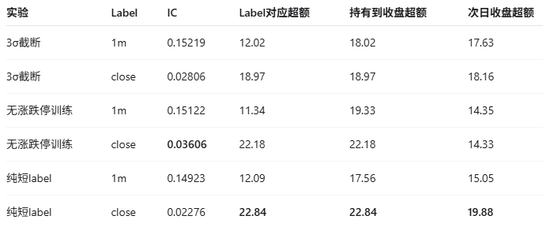
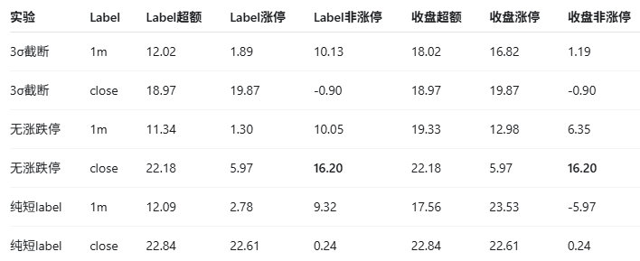

# DS350 09:31 label shortcut ablation closeout

本目录归档 `09:31-09:40`、2022-2025 rolling OOS 的三组 label 诊断实验。所有模型沿用
DS350 grouped-gated NN、36 个月训练、6 个月测试、max 30 epochs；验证和 Top100 选股均使用
`pool_L`。只比较 `1m` 和 `close` 两个 horizon。

## 实验定义

- `3σ截断`：每日截面内分别将 short 与 next-close 原始收益截到均值正负 3 倍标准差，重新计算
  z-score 后仍使用原 mixed target。
- `无涨跌停`：训练时删除 `UpdownLimitStatus != 0` 的样本，首个 36 个月训练 fold 删除
  `781,020 / 28,971,840 = 2.696%`；验证时不删，仍在完整 `pool_L` 中选 Top100。
- `纯短label`：令 next-close 权重为 0，target 只保留对应的 `1m` 或 `close` 截面 z-score。

## 主要结果

[原始截图文件：三组实验结果总表](企业微信截图_17865898491793.png)；可检索数据见
[three_experiment_summary.csv](three_experiment_summary.csv)。单位除 IC 外均为 bps。

| 实验 | Label | IC | Label对应超额 | 持有到收盘超额 | 次日收盘超额 |
| --- | --- | ---: | ---: | ---: | ---: |
| 3σ截断 | 1m | 0.15219 | 12.02 | 18.02 | 17.63 |
| 3σ截断 | close | 0.02806 | 18.97 | 18.97 | 18.16 |
| 无涨跌停训练 | 1m | 0.15122 | 11.34 | 19.33 | 14.35 |
| 无涨跌停训练 | close | **0.03606** | 22.18 | 22.18 | 14.33 |
| 纯短label | 1m | 0.14923 | 12.09 | 17.56 | 15.05 |
| 纯短label | close | 0.02276 | **22.84** | **22.84** | **19.88** |

[原始截图文件：涨停与非涨停贡献拆分](企业微信截图_17865898257957.png)；可检索数据见
[limit_contribution_summary.csv](limit_contribution_summary.csv)。涨停指最终收盘涨停；贡献为相对于
完整 `pool_L` 的可加总 Top100 超额贡献。

| 实验 | Label | Label超额 | Label涨停 | Label非涨停 | 收盘超额 | 收盘涨停 | 收盘非涨停 |
| --- | --- | ---: | ---: | ---: | ---: | ---: | ---: |
| 3σ截断 | 1m | 12.02 | 1.89 | 10.13 | 18.02 | 16.82 | 1.19 |
| 3σ截断 | close | 18.97 | 19.87 | -0.90 | 18.97 | 19.87 | -0.90 |
| 无涨跌停 | 1m | 11.34 | 1.30 | 10.05 | 19.33 | 12.98 | 6.35 |
| 无涨跌停 | close | 22.18 | 5.97 | **16.20** | 22.18 | 5.97 | **16.20** |
| 纯短label | 1m | 12.09 | 2.78 | 9.32 | 17.56 | 23.53 | -5.97 |
| 纯短label | close | 22.84 | 22.61 | 0.24 | 22.84 | 22.61 | 0.24 |

## 涨停富集

2022-2025 完整 `pool_L` 中最终涨停率为 `0.9611%`。close 模型 Top100 中，3σ截断和纯短label
的最终涨停率分别为 `3.6900%` 和 `3.7961%`，即基准的 `3.84x/3.95x`；无涨跌停 close
模型降至 `1.1512%`，即 `1.20x`。因此，无涨跌停 close 模型已经基本消除对涨停股的数量富集，
同时次日收盘超额回落到 `14.33 bps`。完整数字见
[top100_final_limit_enrichment.csv](top100_final_limit_enrichment.csv)。

无涨跌停 1m 模型仍有 `2.4896%` 的最终涨停率，并且持有至收盘的 `19.33 bps` 中有
`12.98 bps` 来自最终涨停股。这不是训练看到了涨停样本，而是短期强势与后来收盘涨停之间存在真实
相关性；它不影响该模型在 1m horizon 上以非涨停贡献为主（`10.05 / 11.34 bps`）的结论。

## Label 分布诊断

1m label 基本连续：最终涨停股只占约 `1.07%`，均值为 `26.92 bps`，普通股均值为
`-8.81 bps`，两组分布有明显重叠；最终涨停股中只有 `14.03%` 高于普通股 P99。三种 1m 模型的
Label Top100 超额也都主要来自非涨停股，因此 1m 连续排序目标暂未发现同等级别的问题。

close label 是明显的状态混合：最终涨停股均值为 `739.47 bps`、中位数为 `733.95 bps`，普通股
均值为 `-5.75 bps`、中位数为 `-13.51 bps`；`54.23%` 的最终涨停股高于普通股 P99。mixed
close target 中约 `1.06%` 的最终涨停样本贡献 `17.07%` 的 target 平方量，即零预测基准下的
MSE。这说明它们对 MSE 优化有显著杠杆，但不是对每个 epoch 实际 residual loss 占比的测量。
分布摘要见 [label_state_distribution.csv](label_state_distribution.csv) 和
[target_tail_composition.csv](target_tail_composition.csv)。

3σ截断将 mixed close target 中涨停股的平方量占比从 `17.07%` 降到 `8.93%`，但 target
Top100 中涨停占比仍约 `30.98%`。它压低了极端值幅度，却没有改变涨停状态集中在 label 顶部的
排序结构，因此不足以消除捷径。

## 结论与决策

1. 纯短label仍然选择涨停，排除了 next-close/隔夜分量单独造成涨停偏好的解释。
2. 删除约 `2.7%` 涨跌停训练样本后，close 模型 Top100 涨停富集降至 `1.20x`，非涨停贡献升至
   `16.20 / 22.18 bps`，支持原 close label + MSE 存在“先识别涨停状态”的优化捷径。
3. 该结果解释的是 label/loss 错配，不构成未来特征泄漏的直接证据。Top100 是尾部评估，只放大并
   揭示全样本 MSE 已学到的排序方向，不参与训练 loss。
4. 1m label 本身基本连续且有非涨停排序能力；1m 模型持有到收盘后的涨停贡献应作为 horizon 暴露
   单独报告，不能据此否定 1m label。
5. 本轮实验归档完成。现有 mixed-MSE close 模型不作为连续 close alpha 的充分证据；下一轮应以
   无涨跌停 close 为基线，分别测试 robust loss 和有界 rank/percentile close target，而不是只继续
   调整标准差截断倍数。

分析脚本与集群入口：

- [三实验统一归因脚本](../../../scripts/build_ds350_clip_tables.py)
- [三实验统一归因 Job](../../../jobs/support/ds350_limit_shortcut_2022_2025_v1/ds350_w0931_three_experiment_tables_job.yaml)
- [label 分布脚本](../../../scripts/analyze_ds350_label_extremes.py)
- [label 分布 Job](../../../jobs/support/ds350_limit_shortcut_2022_2025_v1/ds350_w0931_label_extremes_analysis_job.yaml)
- [实验定义](../../../runs/ds350_w0931_limit_shortcut_ablation_2022_2025_v1.toml)
- [原始截图来源与校验和](source_manifest.json)
