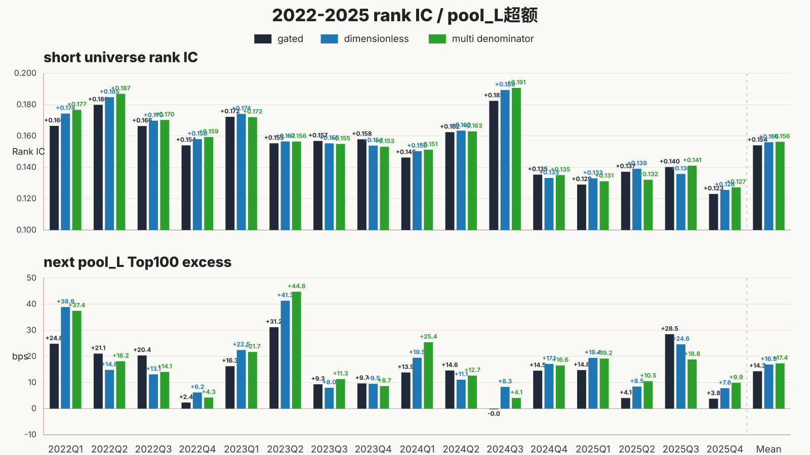
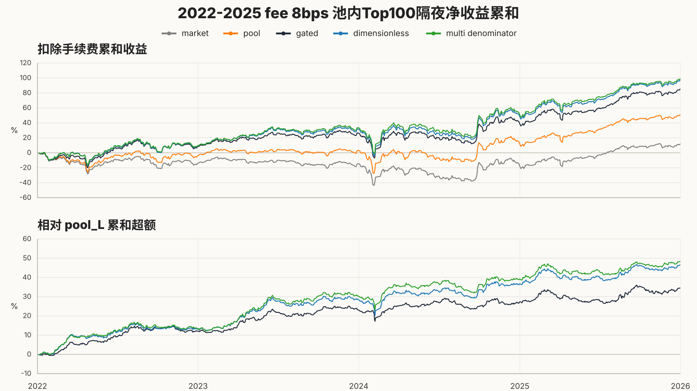
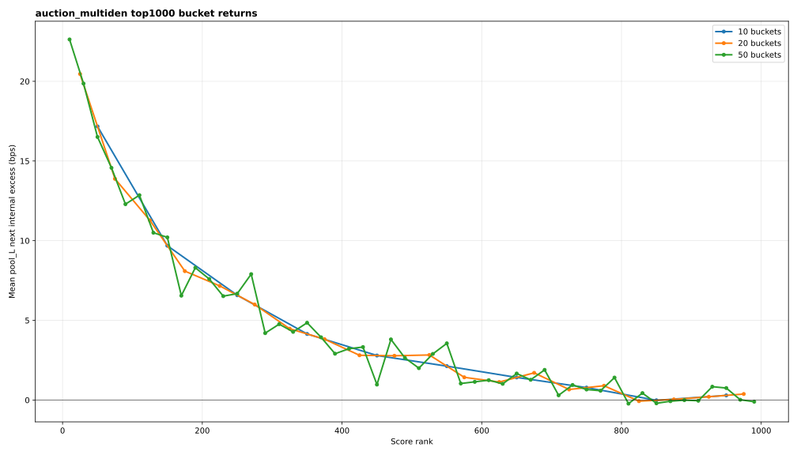
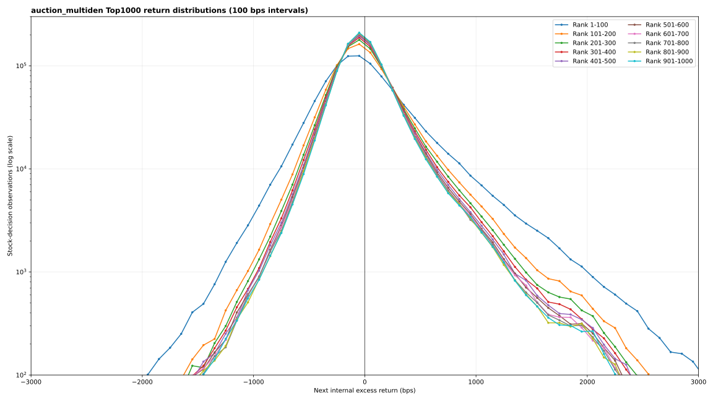
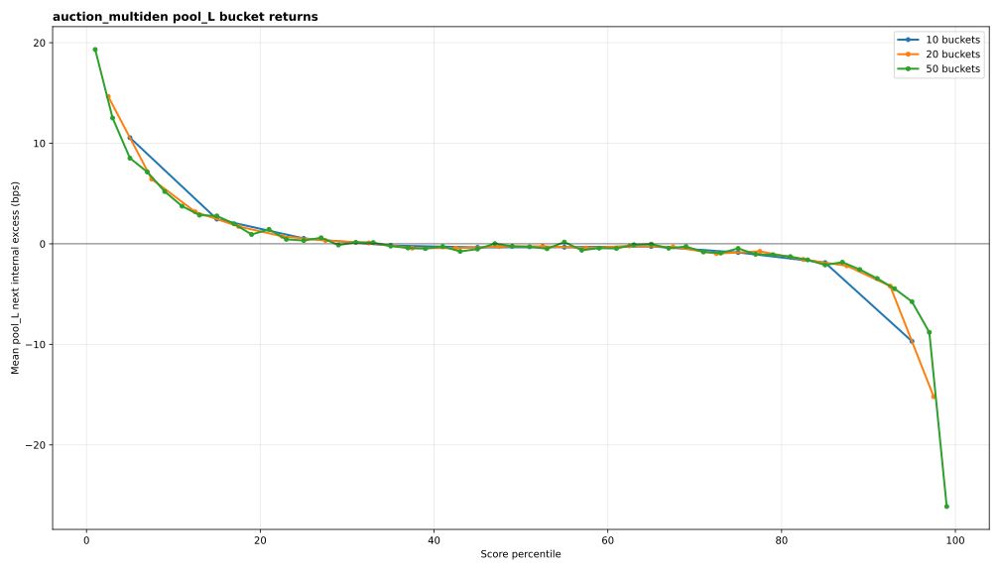
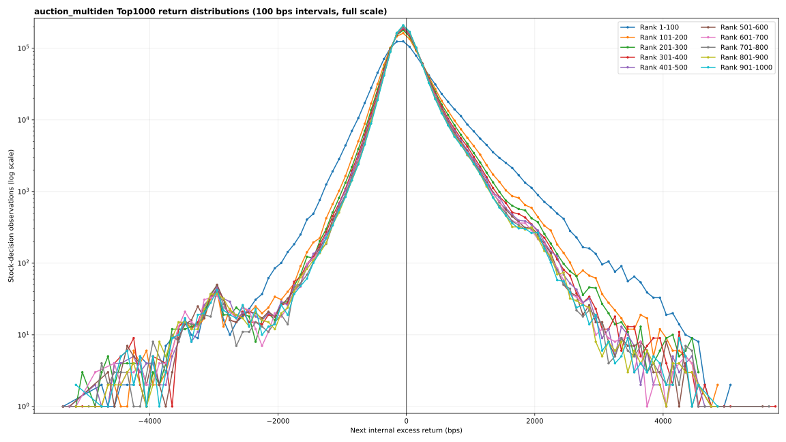
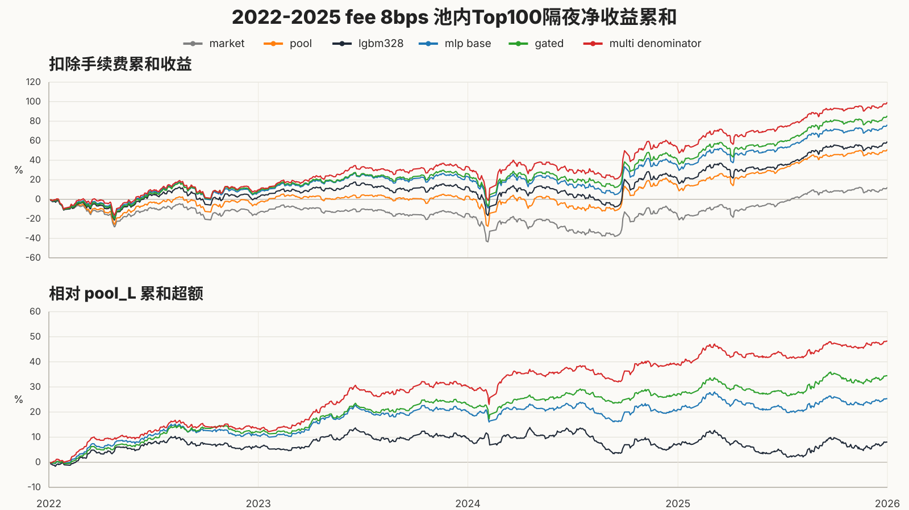

# Fixed-clock v4 multiden seven-figure evidence bundle

This is the tracked presentation and review bundle for the current canonical challenger,
`clock6_v4_multiden`. The simpler control remains in figures 1 and 2 as the single-change ablation
baseline; it is no longer the canonical continuation candidate.

| Figure | Acceptance question | Compact data | Trace |
| --- | --- | --- | --- |
| 1. Signal acceptance | Does multiden preserve short IC and improve `pool_L` Top100 next excess? | [CSV](01_signal_acceptance.csv) | [optimization trace](trace_optimization.json) |
| 2. Top100 cumulative | Does the fee-adjusted cumulative curve beat the incumbent and `pool_L` background? | [CSV](02_top100_cumulative.csv) | [optimization trace](trace_optimization.json) |
| 3. Top1000 bucket curve | Does the score head decay smoothly across several bucket widths? | [CSV](03_top1000_bucket_curve.csv) | [bucket trace](trace_top1000_bucket.json) |
| 4. Top1000 distribution | Is the bucket ordering visible across the full return distribution? | [CSV](04_top1000_return_distribution.csv) | [distribution trace](trace_top1000_distribution.json) |









Companion views retain the core four-figure contract while exposing its wider context:

| View | Diagnostic question | Compact data | Trace |
| --- | --- | --- | --- |
| 3b. Full-pool bucket curve | Does the Top1000 head shape extend across the complete `pool_L` score ranking? | [CSV](03b_full_pool_bucket_curve.csv) | [bucket trace](trace_top1000_bucket.json) |
| 4b. Full-scale Top1000 distribution | What do the complete sparse tails look like outside the fixed `±3000 bps`, `y≥100` acceptance window? | [CSV](04_top1000_return_distribution.csv) | [distribution trace](trace_top1000_distribution.json) |
| 5. Model-journey cumulative | How did fee-adjusted Top100 cumulative performance evolve from LGBM328 through MLP base and grouped-gated to multiden? | [CSV](05_model_journey_cumulative.csv) | [journey trace](trace_model_journey.json) |







The signal comparison reports `pool_L` next excess of `14.3174/16.8024/17.1714 bps` for the
incumbent/control/multiden lines. Multiden is selected as the project continuation candidate, while
the weaker period-by-period A/B win rate remains a documented limitation. Its unified downstream
acceptance still fails the tail gate, so this replacement does not promote the current opening
policy to a tradable strategy.

The bundle is deterministic and records source paths, sizes, and SHA-256 digests in
[manifest.json](manifest.json). Rebuild it from the ignored local mirror with:

```bash
make evidence-four-figures
```

The model definition is the matching [run TOML](../../../runs/nn_delay6_clock_state_36m_2022_2025_auction_pruned_multi_denominator_grouped_gated_v2_mech_v3_gelu_mse_v1.toml).
The final capacity/refill/tail tables are in the
[multiden strategy evidence](../strategy_acceptance_clock6_v4_multiden_2022_2025_v1/).
