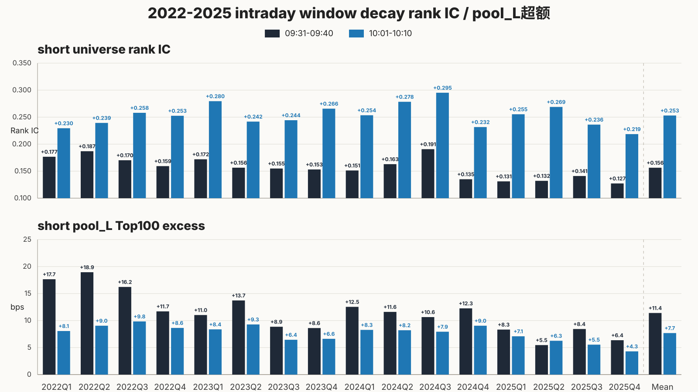
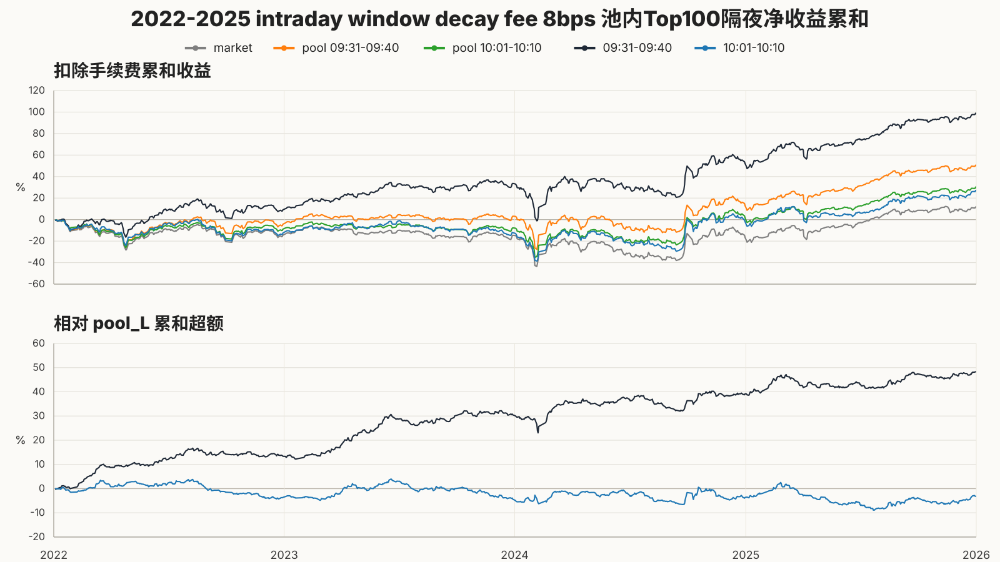
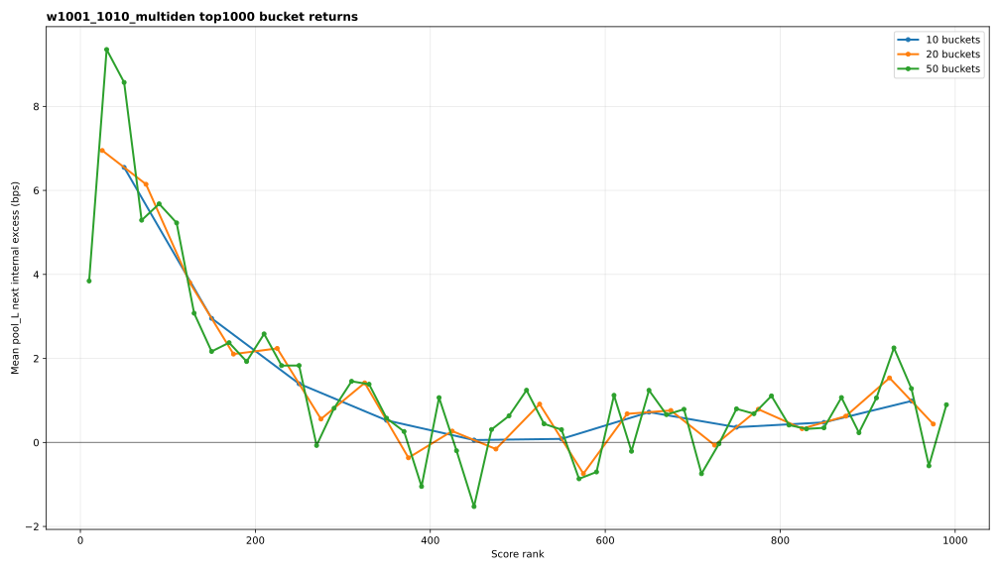
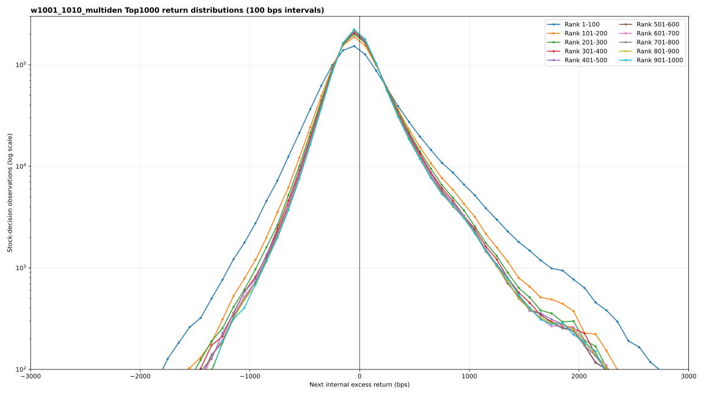

# 10:01-10:10 intraday-window decay acceptance

This is the tracked closeout bundle for the first completed intraday-window decay experiment. It
keeps the fixed-clock v4 multi-denominator feature/model/target/pool/rolling-OOS definitions and
changes the ten-minute decision window and its cache/label lineage from `09:31-09:40` to
`10:01-10:10`.

| Figure | Acceptance question | Compact data | Trace |
| --- | --- | --- | --- |
| 1. Signal acceptance | How do short universe Rank IC and `pool_L` Top100 next excess decay versus 09:31? | [CSV](01_signal_acceptance.csv) | [optimization trace](trace_optimization.json) |
| 2. Top100 cumulative | How much fee-adjusted cumulative return and market-relative alpha survive at 10:01? | [CSV](02_top100_cumulative.csv) | [optimization trace](trace_optimization.json) |
| 3. Top1000 bucket curve | Does later-window score ordering retain a smooth head-to-tail shape? | [CSV](03_top1000_bucket_curve.csv) | [bucket trace](trace_top1000_bucket.json) |
| 4. Top1000 distribution | How do the ten 100-name score buckets differ across fixed 100 bps return intervals? | [CSV](04_top1000_return_distribution.csv) | [distribution trace](trace_top1000_distribution.json) |

The full-sample comparison is:

| metric | 09:31-09:40 incumbent | 10:01-10:10 | change |
| --- | ---: | ---: | ---: |
| universe short Rank IC | 0.156418 | 0.253118 | +0.096700 |
| `pool_L` short Rank IC | 0.142410 | 0.242669 | +0.100259 |
| `pool_L` short Top100 excess | 11.3773 bps | 7.6759 bps | -3.7014 bps |
| `pool_L` next Rank IC | 0.007140 | 0.001836 | -0.005304 |
| `pool_L` next Top100 excess | 17.1714 bps | 6.5491 bps | -10.6223 bps |
| positive next months | 37/48 | 29/48 | -8 months |
| positive next half-years | 8/8 | 6/8 | -2 half-years |
| Top100 fee-8 cumulative return | 9891.7 bps | 2708.5 bps | -7183.2 bps |
| cumulative alpha versus market | 8715.2 bps | 1532.0 bps | -7183.2 bps |
| Top1000 first/last 100-name bucket | 17.17/0.29 bps | 6.55/0.99 bps | weaker head separation |

Training used the dedicated `10:01-10:10` mixed-w030 cache. Pool analysis used the matching
window-specific next-close label directory and joined all `44,993,233` prediction rows. The main
signal figures retain all `9,690` decision cross-sections. The Top1000 diagnostics retain
`9,688/9,690`; two anomalously small 2022H2 `pool_L` cross-sections had fewer than 1,000 candidates
and were excluded only from Top1000 plots.

Decision: archive as a completed decay checkpoint, not as a replacement for the 09:31 opening
policy. Later-window short cross-sectional ordering is stronger, but the tradable overnight head
effect, monthly/half-year stability, fee-adjusted cumulative return, and Top1000 head separation all
decay materially. No downstream capacity/realistic promotion audit is warranted for this window.

Aggregate pool summaries are retained in [pool_internal_summary.csv](pool_internal_summary.csv) and
[pool_internal_halfyear_summary.csv](pool_internal_halfyear_summary.csv). Distribution bucket
statistics are in [top1000_distribution_summary.csv](top1000_distribution_summary.csv). Source
paths, sizes, and SHA-256 digests are recorded in [manifest.json](manifest.json).

The experiment definition is the matching
[run TOML](../../../runs/nn_delay6_clock_state_36m_2022_2025_w1001_1010_auction_pruned_multi_denominator_grouped_gated_v2_mech_v3_gelu_mse_v1.toml).
