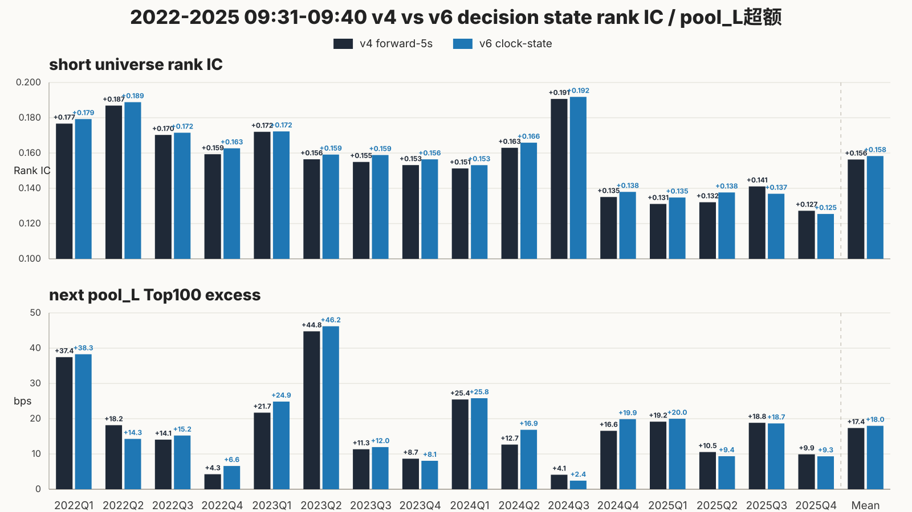
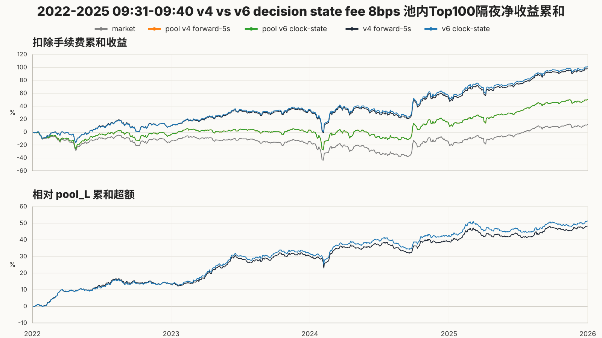
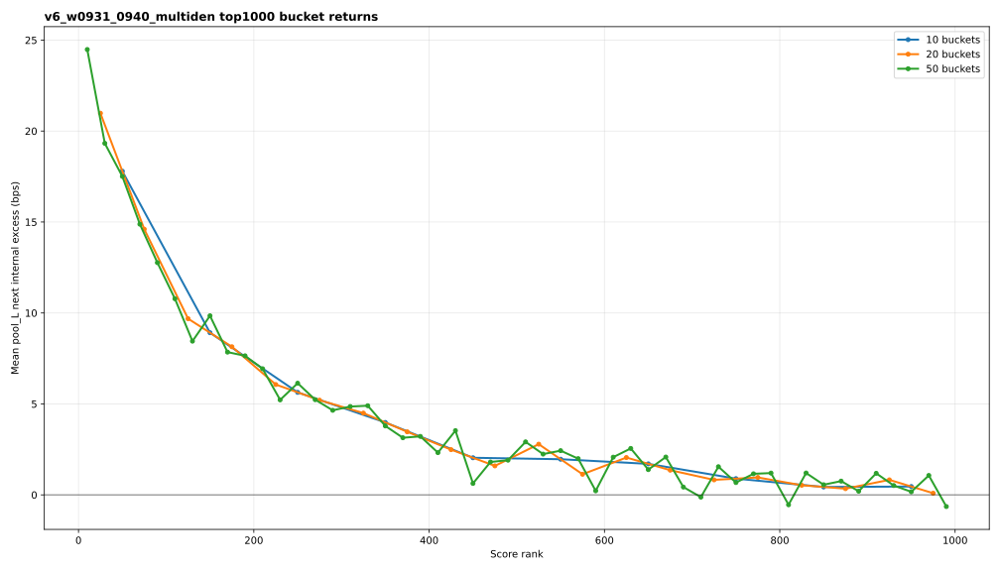
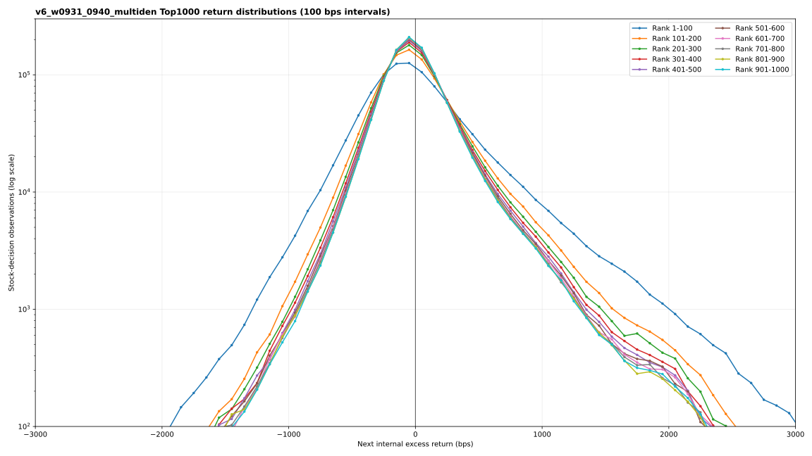

# opening_model source-run acceptance archive

This is the immutable source-run bundle behind the canonical short name `opening_model`. It records
the tracked signal-level acceptance for the controlled rerun of the archived v4
multi-denominator opening model on the corrected v6 decision-state cache. The target, 350 features,
model, `09:31-09:40` clocks, `clock+6s` entry, pools, rolling OOS windows, and seed are unchanged.
The controlled change is decision sampling: v4 accepted the first physical update within five
seconds after the target clock, while v6 reads the last state already known at the target clock.

| Figure | Acceptance question | Compact data | Trace |
| --- | --- | --- | --- |
| 1. Signal acceptance | Does causal clock-state sampling preserve short universe Rank IC and `pool_L` Top100 next excess versus v4? | [CSV](01_signal_acceptance.csv) | [optimization trace](trace_optimization.json) |
| 2. Top100 cumulative | Does fee-adjusted Top100 cumulative return and matching-`pool_L` excess survive the correction? | [CSV](02_top100_cumulative.csv) | [optimization trace](trace_optimization.json) |
| 3. Top1000 bucket curve | Does the corrected score retain a smooth head-to-tail shape across bucket widths? | [CSV](03_top1000_bucket_curve.csv) | [bucket trace](trace_top1000_bucket.json) |
| 4. Top1000 distribution | Is the ordering visible across the full return distribution without a new sample or tail anomaly? | [CSV](04_top1000_return_distribution.csv) | [distribution trace](trace_top1000_distribution.json) |

The full-sample comparison is:

| metric | archived v4 | corrected v6 | change |
| --- | ---: | ---: | ---: |
| OOS prediction rows | 47,333,122 | 47,333,103 | -19 |
| universe short Rank IC | 0.156418 | **0.158330** | +0.001912 |
| `pool_L` short Rank IC | 0.142410 | **0.144132** | +0.001722 |
| `pool_L` short Top100 excess | 11.3773 bps | **11.7543 bps** | +0.3770 bps |
| `pool_L` next Rank IC | 0.007140 | **0.007839** | +0.000699 |
| `pool_L` next Top100 excess | 17.1714 bps | **17.7934 bps** | +0.6219 bps |
| positive next months / half-years | 37/48; 8/8 | **38/48; 8/8** | +1 month; unchanged halves |
| Top100 fee-8 cumulative return | 9891.7 bps | **10193.0 bps** | +301.3 bps |
| cumulative net excess versus matching `pool_L` | 4828.6 bps | **5129.9 bps** | +301.3 bps |
| Top1000 first/last 100-name bucket | 17.17/0.29 bps | **17.79/0.46 bps** | head-tail spread +0.46 bps |

The correction therefore does not explain the v4 result away. It slightly improves all aggregate
signal metrics while keeping all eight half-years positive. The improvement is not a strong
period-by-period A/B victory: v6 next excess wins only `26/48` months and `492/969` days, with
v4/v6 correlations of `0.9890` monthly and `0.9842` daily. The result is best read as “causal
correction with no degradation and a modest mean uplift,” not as a new model breakthrough.

The Top1000 diagnostics support the same interpretation. Both versions have a smooth ten-bucket
curve with bucket-order Spearman `0.9879`. V6 raises the first 100-name bucket by `0.62 bps` and
widens the first-to-last spread from `16.88` to `17.34 bps`, while the average across all Top1000
buckets is slightly lower (`4.38` versus `4.50 bps`). The gain is concentrated in the selected
head rather than being a uniform pool-wide uplift. Distribution shape is nearly unchanged:
`9,690,000` observations, `567` returns beyond absolute `4000 bps` versus v4's `565`, and no
missing-label or incomplete-Top1000 cross-section.

Decision: promote this result to the latest signal/model baseline under the short name
`opening_model`; the corresponding training cache is `opening_cache`. Do not mechanically inherit
or overwrite the archived v4 unified capacity/refill strategy evidence; rerun that downstream
acceptance on `opening_model`.

Aggregate summaries are retained in
[pool_internal_summary.csv](pool_internal_summary.csv) and
[pool_internal_halfyear_summary.csv](pool_internal_halfyear_summary.csv). Distribution bucket
statistics are in [top1000_distribution_summary.csv](top1000_distribution_summary.csv). Source
paths, sizes, and SHA-256 digests are recorded in [manifest.json](manifest.json).

The experiment definition is the matching
[run TOML](../../../runs/nn_delay6_v6_decision_clock_state_36m_2022_2025_w0931_0940_auction_pruned_multi_denominator_grouped_gated_v2_mech_v3_gelu_mse_v1.toml).
The current short-name mapping is in the
[canonical registry](../../../canonical/opening.toml).
