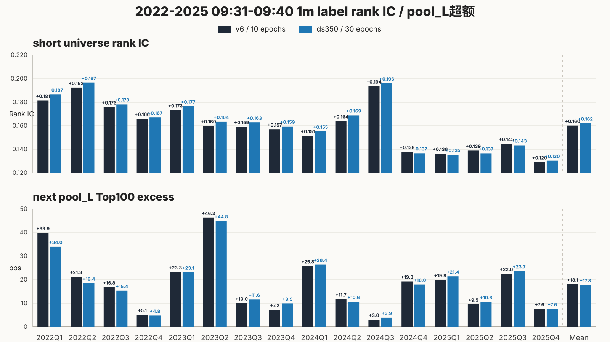
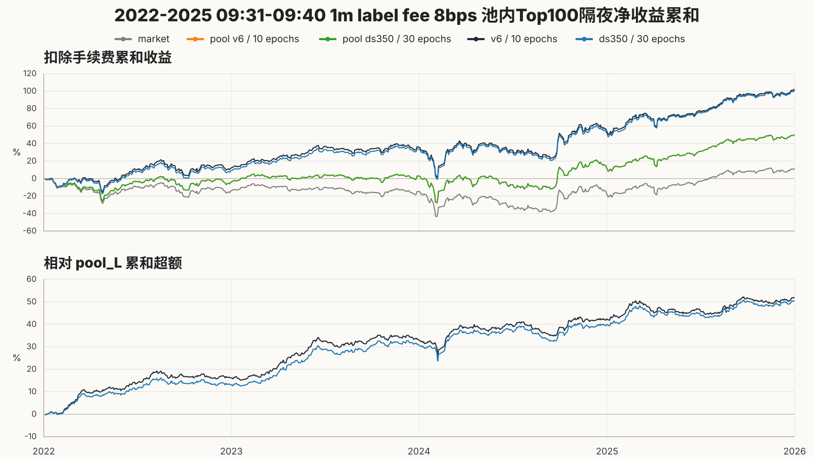
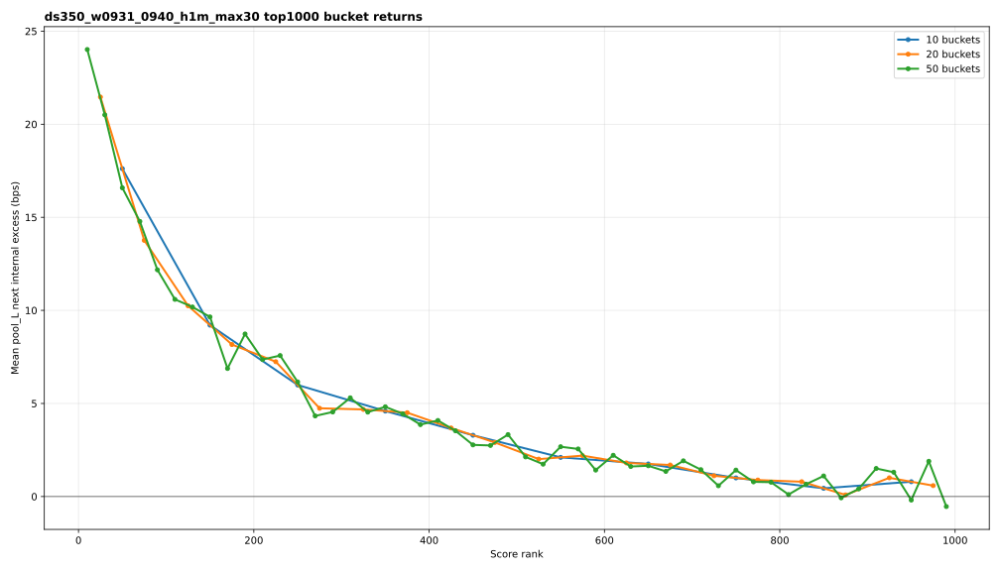
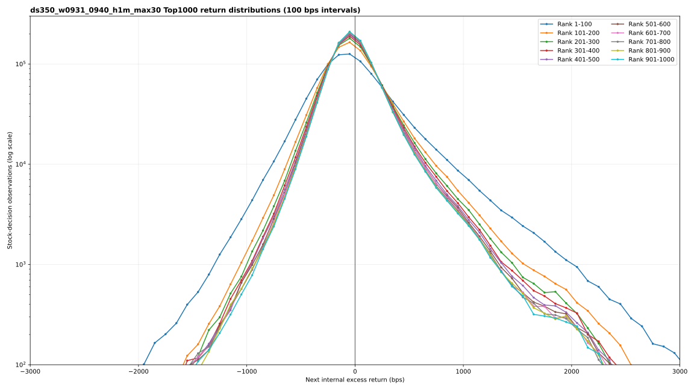

# ds350 max-30 15-label result archive

This is the authoritative compact archive for `nn_ds350_label15_36m_grouped_gated_v2_mse_max30_v1`. All 15 matrix cases and all
120 rolling OOS folds completed. The mean best epoch is `20.32`;
`107/120` folds selected an epoch after 10 and
`36/120` selected epoch 30.

The standard four figures below focus on `09:31-09:40 / 1m`. Figures 1-2 compare the
authoritative max-30 result with the matching prior v6 1m / 10-epoch run. Figure 2 applies an
8 bps realized fee and shows next-close economic follow-through relative to each run's matching
`pool_L`. Figures 3-4 diagnose the current max-30 score head over Top1000 only.

## Fifteen-label matrix

| case | window | horizon | universe short IC | pool_L short excess bps | pool_L next excess bps | pool_L next IC | mean best epoch |
| --- | --- | --- | --- | --- | --- | --- | --- |
| w0931_0940_h1m | 09:31-09:40 | 1m | 0.1622 | 11.9609 | 17.6132 | 0.0093 | 14.2500 |
| w0931_0940_h3m | 09:31-09:40 | 3m | 0.1090 | 12.8165 | 20.4689 | 0.0105 | 14.6250 |
| w0931_0940_h5m | 09:31-09:40 | 5m | 0.0891 | 13.3887 | 20.0002 | 0.0104 | 18.1250 |
| w0931_0940_h10m | 09:31-09:40 | 10m | 0.0666 | 13.9995 | 20.6595 | 0.0107 | 27.2500 |
| w0931_0940_h1h | 09:31-09:40 | 1h | 0.0313 | 16.3934 | 19.6929 | 0.0106 | 30.0000 |
| w0931_0940_hclose | 09:31-09:40 | close | 0.0308 | 20.7256 | 19.8057 | 0.0143 | 29.8750 |
| w1001_1010_h1m | 10:01-10:10 | 1m | 0.2633 | 8.5195 | 7.1724 | 0.0046 | 13.3750 |
| w1001_1010_h3m | 10:01-10:10 | 3m | 0.1893 | 8.5339 | 9.3589 | 0.0058 | 15.3750 |
| w1001_1010_h5m | 10:01-10:10 | 5m | 0.1565 | 8.5614 | 10.3231 | 0.0063 | 13.6250 |
| w1001_1010_h10m | 10:01-10:10 | 10m | 0.1139 | 8.3107 | 10.5086 | 0.0082 | 26.7500 |
| w1001_1010_h1h | 10:01-10:10 | 1h | 0.0435 | 7.6359 | 9.8904 | 0.0121 | 29.8750 |
| w1001_1010_hclose | 10:01-10:10 | close | 0.0411 | 14.5546 | 10.7120 | 0.0150 | 30.0000 |
| w1401_1410_h1m | 14:01-14:10 | 1m | 0.3801 | 7.6319 | 1.1508 | 0.0096 | 12.2500 |
| w1401_1410_h3m | 14:01-14:10 | 3m | 0.3176 | 8.0843 | 2.1626 | 0.0124 | 12.8750 |
| w1401_1410_h5m | 14:01-14:10 | 5m | 0.2816 | 8.0466 | 2.7231 | 0.0133 | 16.6250 |

The aggregate training, OOS, and pool-internal sources are retained as compact CSVs. Large
predictions, model binaries, and row-level labels remain on the PVC and are addressed by the run
config, source revision, input lineage, and hashes in `manifest.json`.
